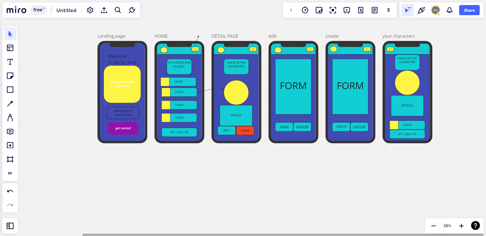

# A DISNEYLAND PROJECT:

## Project Description:
This is a PWA that has been built with Angular and Ionic.  You can see all Disney characters, create new ones and update or delete any of them. It has 7 main pages: The login/signup page, the landing, the list of characters page, the character details page, the update character page, the edit character page and your characters page, where the user can see the characters he/she/they have created themselves.

## Wireframes:
  

## Setup:
Open the console and run **ionic serve**

## Technologies used:
For the layout and styling of the app I have used : 

 - HTML
 - SCSS
 - THEMES AND IONIC COMPONENTS

For the functionalities of the website I have used:

 - Angular
 - Ionic

##    Components and Pages structure

 1. Login/sign up page: authentication of the user.
 2.  Landing: Just a welcome page.
 3. Home: A page where a list of all characters is rendered, if you click on them it will take you to the detail page. You can also slide them to access the update page or delete them.
 4. Details Page: A page with more info of each character, it has 3 buttons: go back at the top, delete and edit at the bottom. Go back will take you to the characters list page, Edit will take you to Edit character component form and delete will delete it.
 5. Edit-character component: A form where you can update your chosen character info, or delete it.
 6. Create characer page: A form where you can create your own character.
 7. Nav bar: a navbar on top to make it easier to go from the characters list page to the create page.
 8. The tabs: At the bottom of the pages, where you can goto the character's list page or to "your characters page".

## Demo:

Singup-login:

Landing:

Characters List Page:

Character details page:

Edit Character Page:

Create new Character Page:

Your characters Page:

## Future work:
In the future I would like to implement a camera functionality where the user has the possibility of taken a picture from the app and upload it.

## Resources:

 1. The Ironhack website.
 2. Stack overflow.
 3. Ionic documentation.
 4. Angular documentation.
 5. Firebase documentation.
 6. Udemy Ionic and angular course.

## Task management:
[Click to go to Trello Board](https://trello.com/b/pvy1iX1h/ionic-project)

## Presentation slides:
[Click to go to Presentation Slides]()

 

## Team members:
Creator: Blanca Bigeriego
Collaborators: My teachers: Raymond Maroun and Shaun Reilly.
